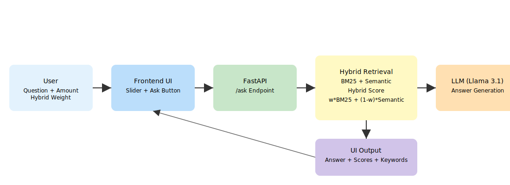

# 🧠 Policy & Rules Copilot — Hybrid RAG AI (Vector + Keyword)
Sample project with Hybrid RAG approach. Vectorless RAG along with Vector DB RAG

## Data Flow


---

## 🚀 Project Overview

**Policy & Rules Copilot** is an enterprise-style **Hybrid Retrieval-Augmented Generation (RAG)** system that helps customer support and operations teams answer policy-related queries accurately and efficiently.

This system combines:

* 🔍 **Keyword Search (BM25)**
* 🧠 **Semantic Search (Embeddings)**
* 🤖 **LLM Reasoning (Llama 3.1 via Ollama)**

…to deliver **fast, explainable, and context-aware responses**.

---

## 🎯 Key Features

### 🔀 Hybrid RAG (Core Feature)

* Combines **BM25 (keyword)** + **semantic similarity (embeddings)**
* Uses weighted scoring:

```text
Hybrid Score = w * BM25 + (1 - w) * Semantic
```

---

### 🎛️ Real-Time Hybrid Weight Control

* Interactive **slider in UI**
* Adjust retrieval behavior:

  * `0.9` → keyword-heavy
  * `0.5` → balanced
  * `0.2` → semantic-heavy

---

### 🔍 Explainable AI

* Shows:

  * BM25 score
  * Semantic similarity
  * Hybrid score
  * Matched keywords

---

### ⚡ Streaming & Responsive UI

* Spinner while processing
* (Optional) streaming responses
* Fast, user-friendly experience

---

### 🛡️ Fault-Tolerant Retrieval

* Missing embeddings → fallback to BM25
* Prevents system failure

---

### 🧑‍💼 Admin Panel

* Add policies dynamically
* Automatically generates embeddings

---

## 🛠️ Tech Stack

| Layer      | Technology            |
| ---------- | --------------------- |
| Backend    | Python, FastAPI       |
| Frontend   | HTML, CSS, JavaScript |
| Database   | SQLite                |
| Retrieval  | BM25 (`rank-bm25`)    |
| Embeddings | sentence-transformers |
| LLM        | Ollama (Llama 3.1)    |

---

## 📂 Project Structure

```
policy-copilot/
│
├── main.py                # FastAPI backend
├── database.py            # DB setup + embeddings
├── rag_engine.py          # Hybrid retrieval logic
├── requirements.txt
│
├── templates/
│   ├── index.html         # UI
│   └── admin.html         # Admin panel
│
├── static/
│   ├── style.css
│   └── script.js
│
├── hybrid_rag_diagram.svg # Architecture diagram
└── README.md
```

---

## ⚙️ Setup Instructions

### 1️⃣ Clone Repository

```bash
git clone <your-repo-url>
cd policy-copilot
```

---

### 2️⃣ Install Dependencies

```bash
pip install -r requirements.txt
```

---

### 3️⃣ Start LLM (Ollama)

Install Ollama and run:

```bash
ollama run llama3.1
```

💡 Recommended faster model:

```bash
ollama pull llama3.1:8b-instruct-q4_0
```

---

### 4️⃣ Run Application

```bash
uvicorn main:app --reload
```

---

### 5️⃣ Open in Browser

* App: http://127.0.0.1:8000
* Admin Panel: http://127.0.0.1:8000/admin

---

## 💡 Example Queries

* "Customer received damaged headphones worth $30"
* "Order delayed by 10 days, what compensation applies?"
* "Broken TV worth $900 refund policy?"

---

## 🧠 How It Works

### Step 1: User Input

* Question + optional amount
* Hybrid weight slider

---

### Step 2: Hybrid Retrieval

* BM25 → keyword matching
* Semantic → embedding similarity
* Combine scores:

```text
Hybrid = w * BM25 + (1 - w) * Semantic
```

---

### Step 3: Context Selection

* Top policies selected
* Passed to LLM

---

### Step 4: LLM Generation

* Generates answer using **only retrieved policies**

---

### Step 5: Explainable Output

* Answer + retrieval reasoning shown in UI

---


## 🧪 Example Output

**Query:**

> "Damaged item worth $40"

**Response:**

> Instant refund applies as per low-value damage policy.

**Explainability:**

* BM25: 2.31
* Semantic: 0.82
* Hybrid: 1.74
* Keywords: damaged, item

---

## 🎯 Skills Demonstrated

| Skill                  | Demonstration            |
| ---------------------- | ------------------------ |
| Retrieval Engineering  | Hybrid BM25 + Semantic   |
| LLM Integration        | Local Llama 3.1          |
| Full Stack Development | FastAPI + JS UI          |
| Explainable AI         | Score breakdown          |
| System Design          | Modular RAG architecture |
| Optimization           | Streaming + fallback     |

---

## 🏁 Why This Project Matters

This project demonstrates a **real-world GenAI architecture** used in:

* Customer support automation
* Policy compliance systems
* Enterprise AI copilots

It showcases both:

* **AI/ML depth (retrieval + embeddings)**
* **Engineering skills (full-stack + system design)**

---

## 📌 License

MIT License

---

## ⭐ If you like this project

Give it a ⭐ on GitHub — it helps!

---
